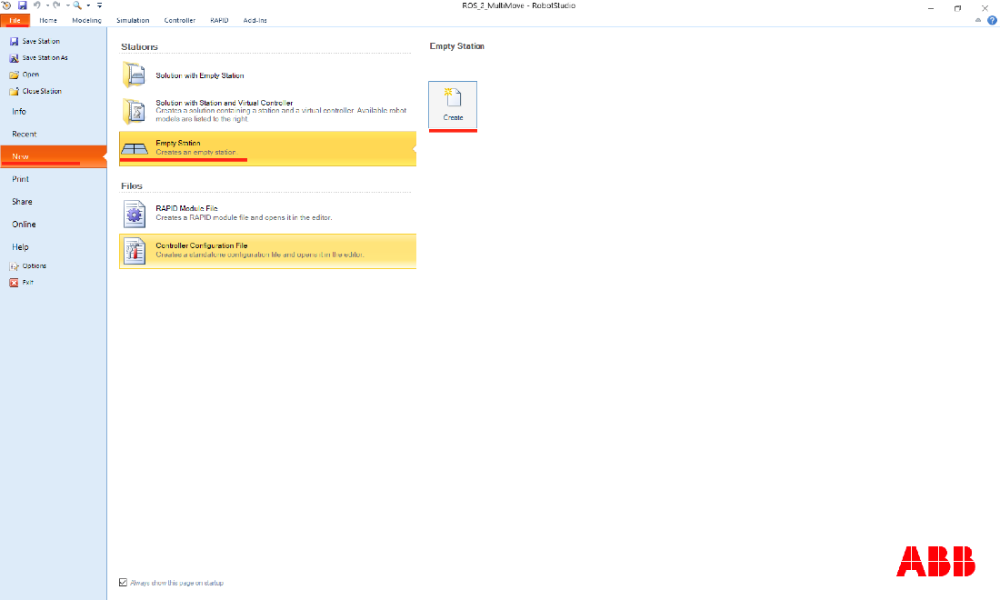
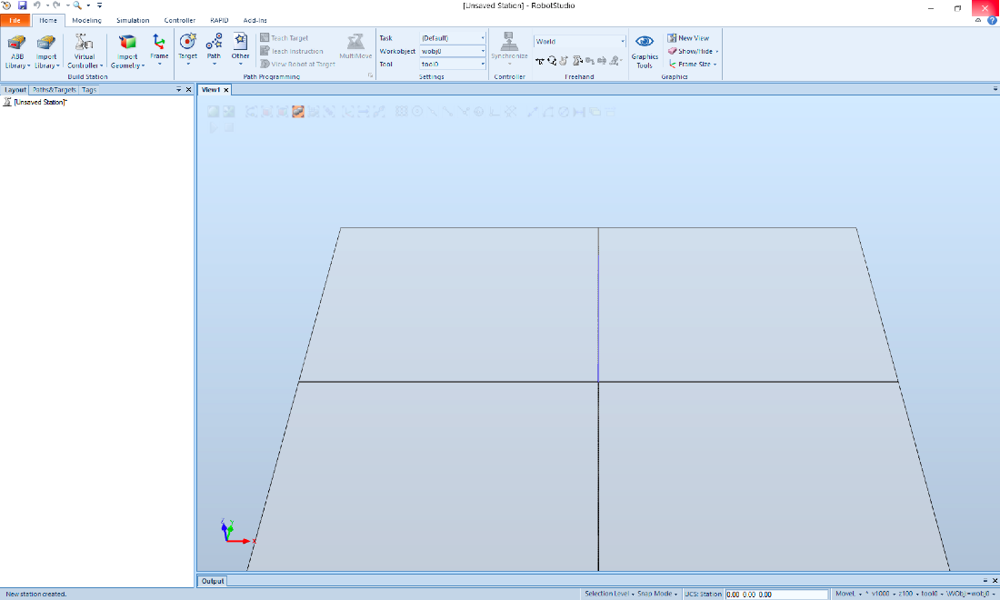
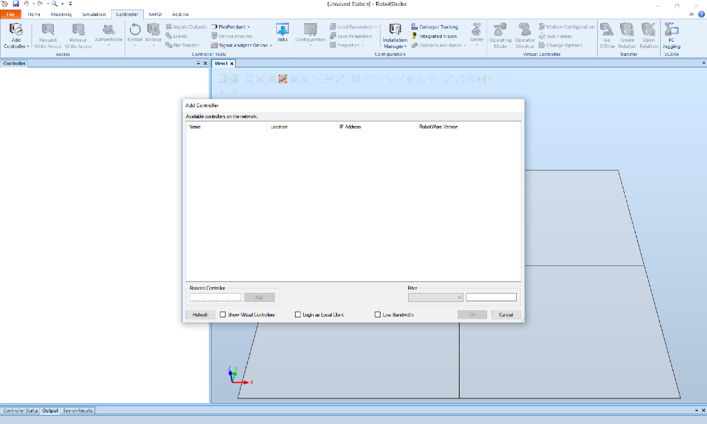

# Robotstudio
RobotStudio is a program in which you can simulate all ABB-robots and products. A great advantage of simulation is that if a change has to be made or if a new application is developed, the production can always continue.
Simulation has its advantages and disadvantages. As mentioned earlier, simulation can ensure that production in, for example, a factory does not have to be stopped. Other advantages are that the risk of erroneous movements can be tested first, and the implementation time of the application can be shortened, because testcases have already been performed in the simulation. A disadvantage of simulation in RobotStudio is that you can only simulate efficiently if the station in RobotStudio exactly matches the application / station of reality. If this is not the case, it is possible that during the implementation things will come up that are not desirable, such as unexpected movements.

### Installation of RobotStudio
Go to: https://new.abb.com/products/robotics/robotstudio/downloads

Download RobotStudion under the subheader ‘RobotStudio’ > ‘Download RobotStudio’.
Be sure to put in the license of RobotStudio after the installation has finished. 

### Station of the real controller in RS
RobotStudio (RS) uses exactly the same software as that of what runs on the real controller of the robots. This makes it possible to get the workstation of the actual situation in RS via a backup.

### Making a backup of the real controller
##### Backup Requirements
To backup the real controller, the following requirements must be met:

- Be on the same network as the controller (robot).
- Access to the flex pendant.
- RobotStudio installed.

If these conditions are met, you can start making a backup of the robot station, and eventually import it into RobotStudio. To get started, in Robotstudio go to "File"> "New"> "Empty Station"> and click "Create". This creates a new empty station which allows us to connect to the real controller over the internet.

To connect to the real controller. Go to tab "Controller"> "Add Controller" (Dropdown menu)> and click "Add Controller ... - Add available controller on the network."
A popup window will apear. Select the contoller you want to add and press "OK". Now you can see the controller in the controller list. To make a backup of the controller

Now we will install ROS on our controller

[Robotstudio with ROS >>>](/Robotstudio/RobotstudioRos.md)
