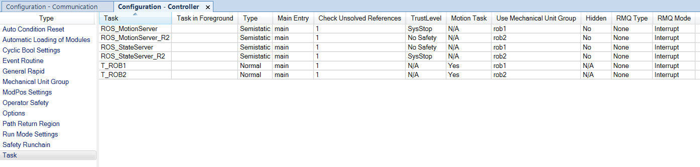
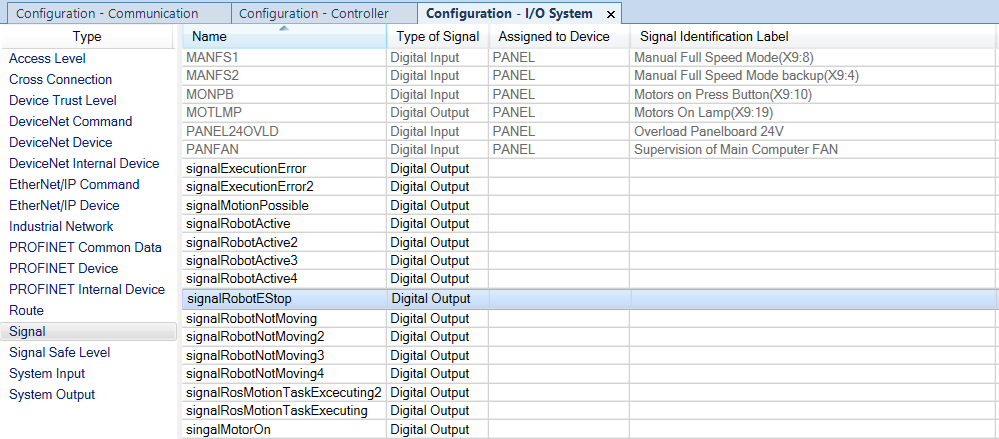
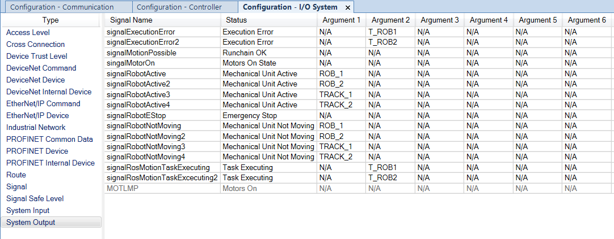

# Robotstudio multiple robots
To be able to use more than 1 robot at the same time, we have to make a few changes to the ros settings inside the controller.

At first we will add tasks for the second robot:

Than we will add new signals for the second robot and in case of the Robotlab setup, signals for the track.

And at last we will add new system outputs for the second robot and the track.

Also before we can control the track with ROS, we need to make some adjustments to the ABB driver files.
Either pull the changes from from this link or simply change it by hand. So you can get a good look at the code while you're at it.

[ABB driver update for track support](https://github.com/ros-industrial/abb/pull/150/commits/fe2ddd5cb0ef9e9c170b98372944e599fc9e42c9)

Now Robotstudio should be all setup for ROS with multiple robots. The two ABB IRB 2600's on the ABB IRBT 2005 Track.