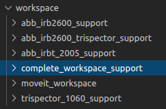
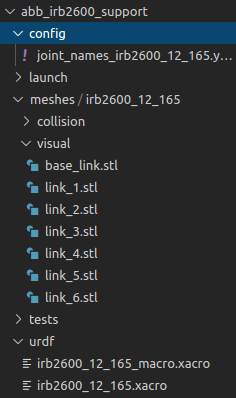

# ROS in the Lab
### Creating an environment
In the Robotlab we have a few different setups. One of those is the 2 ABB IRB 2600’s on a 10-meter-long IRBT 2005 track. We will be setting this environment up in a ROS package. This tutorial should both work for ROS Kinetic and Melodic.

To start off create a clean workspace with the following commands.
> $ mkdir -p ~/catkin_ws/src
> $ cd ~/catkin_ws/
> $ catkin_make

If you are installing Melodic or use Python 3 in general than the first catkin_make command in a clean catkin workspace must be:
> $ catkin_make -DPYTHON_EXECUTABLE=/usr/bin/python3

After building (using catkin_make) your workspace, you must always use the source command. 
> $ source devel/setup.bash

You can also setup your terminal to trigger this command, when you open the terminal window. This way, you don’t have to enter the source command every time when you’re want to work with this workspace. To automatically execute this command, edit the bashrc file:
> $ gedit ~/.bashrc

Add: source ~/catkin_ws/devel/setup.bash   to the end of the file.

To create a new package cd to your src folder and use the following command. Give your package a name. you can leave the dependencies alone for now.

Since we will be using ABB robot, we need to download a few files from git. While in your src folder use the following commands.

> git clone https://github.com/ros-industrial/abb_experimental.git
>
> git clone https://github.com/ros-industrial/abb.git
>
> git clone https://github.com/ros-industrial/industrial_core.git

Afterwards you want to navigate to the root folder of your workspace and build your workspace again.
> $ catkin_make

### Your own workspace
Now that we have created an environment to work in, we’ll be creating a workspace. A workspace is basically a combination of packages suited to your needs. For instance, in the robot lab we make use of different robots. One workspace could be of the small robot, the IRB 1200. Or what we’ll be using the two IRB 2600’s on a track. In the workspace we can combine different packages without damaging their original structure. We have packages of the track and the robots separately and combine them. To save time download the workspace from git with the link below.
> $ git clone “insert link of workspace here"

One of the robots in the lab had a trispector attached. So, we had to include it in our workspace to avoid collision. The robot setup with trispector is made Nicola Hinssen. Repository below.

https://github.com/nicolahinssen/ros_abb_irb2600_trispector

After downloading the workspace we’ll be explaining some of the workflow.
In our workspace we have a few different packages.

There are 4 packages we use to build our workspace. Abb_irb2600_support, abb_irb2600_trispector_support, abb_irbt_2005_support and trispector_1060_support.

Let’s start off with looking at one of the packages, the abb_irb2600_support.

At first the meshes. They are the individual joint the robot has and can move. It includes the physical representation of the robot and the collision range. The collision files are slightly bigger so your programs can calculate when to stop with some error margin. In your urdf/xacro files you join the individual joints together. If you want to see how that works, look in the urdf folder. You can see how every joint is connected. 

If you go to the complete_workspace_support folder now and to the urdf folder. You can see how the entire workspace is put together using the other packages. The irb_2600 with and without trispector and the track. Now we basically have a blueprint of our entire setup. Before we can use it though we have to make actual models from the blueprint, that can move. To do this we use Moveit and Rviz. Below will be a link on how to create your own Moveit_workspace after you create your own setup.

https://ros-planning.github.io/moveit_tutorials/doc/setup_assistant/setup_assistant_tutorial.html

However, for demonstration purposes there is a moveit_workspace included in the files you downloaded. To check out the models we will make use of launch files. ROS itself has a bunch of features and being able to use launch files is one of them. To open the whole setup, use the following command WHILE your terminal is inside your work environment.
> $ roslaunch moveit_workspace demo.launch

Now a Rviz screen should open up with the 2 robots on the track. From here you see in the top left panel “MotionPlanning”. In the list you see Planning request. Open that up and on the top, you see “Planning group”. Here you can select the different parts you can move around. You now have a moveable work environment of your own robot setup.

